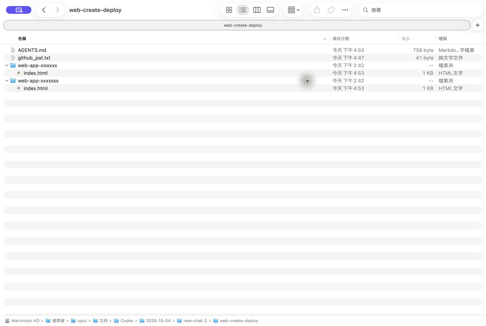

# Web Create Deploy：Codex 新手網站發布

每個 web app 一個 GitHub repository，共用放在父資料夾的 PAT。Skill 支援靜態 HTML、CSS、JavaScript；保留 macOS 34 項模擬測試結果，Windows 11／PowerShell 5.1 已完成 20 項隔離測試與兩站真實發布、同網址更新驗證。

## 學員從這裡開始

先完成[桌面版系統需求與更新](docs/課前準備-ChatGPT桌面版與系統更新.md)，再依下列步驟安裝 Skill。完整圖解 HTML 開頭已整合相同說明。

1. 在 Codex 開啟可讀寫本機資料夾的工作環境。
2. 複製 [安裝提示詞](INSTALL-PROMPT.md) 的整段文字貼給 Codex，讓它安裝 Skill 並建立範例工作區。
3. 跟著 [完整圖解教材](docs/新手完整圖解教學.html) 建立 GitHub PAT。可下載 HTML 後用瀏覽器開啟，圖片均已內嵌。
4. 將 PAT 存到 web-create-deploy/github_pat.txt，再指定要發布的網站。

```text
web-create-deploy/
  AGENTS.md
  github_pat.txt           ← 只留本機，請自行建立
  web-app-oooxxx/
    index.html            ← 一個 repo
  web-app-xxxxsss/
    index.html            ← 另一個 repo
```

根目錄不可初始化 Git，也不可整包上傳。腳本僅在指定網站內操作 Git；PAT 由上一層讀取，網站內有 PAT 會拒絕發布。這能隔離範圍，但仍不應將 PAT 複製到網站內容或分享整個根目錄。



## 發布提示詞

```text
使用 $github-pages-beginner，發布 web-create-deploy 裡的 web-app-oooxxx。
PAT 已在 web-create-deploy/github_pat.txt，請由腳本讀取，不顯示內容。
只將 web-app-oooxxx 建立為公開 repository，完成後給我網站網址。
```

要發布第二個網站時，把名稱改成 web-app-xxxxsss。要更新時說「更新 web-app-oooxxx，沿用原本網址」。

## 講師與維護

- [Windows 11 測試與補圖清單](docs/Windows11-測試與補圖.md)
- [測試報告](TEST_REPORT.md)
- [維護說明](CLAUDE.md)
- Skill 版本：2.0.0。starter 中刻意不含 github_pat.txt，學員自行建立。
- 教材整合版：2.0.2；共 22 張內嵌圖片，新增 8 張 Windows 真實畫面。Codex 安裝／叫用視窗仍待人工補圖，詳見測試報告。
- 公開程式碼供課堂安裝，安裝時不需要 PAT；PAT 只用於發布學員自己的網站。

工作區 Windows 圖片已補換清晰原生 PNG；其餘兩張檔案總管圖片仍待補正，進度見測試報告。
